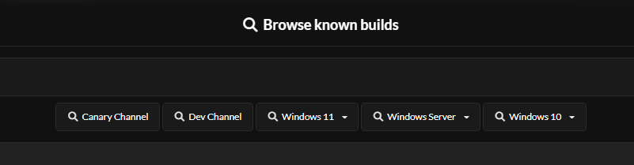
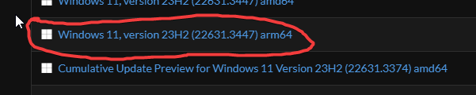

<!DOCTYPE html>
<body>

# 🚀 NeptuneOS Installation

> We are not responsible for any personal files you may lose, or any hardware issues you may experience while using NeptuneOS.  
> We are fully open source, and NOT for sale.

> If something has a ⭐, this means it is the recommended method.

## 🔍 Prerequisites

- A USB (Optional)
- A backup of your personal files on another drive
- A general understanding of your system, and windows itself

## 💻 Reinstalling Windows

You must reinstall windows to install NeptuneOS. This is to prevent unforseen issues in the OS.  
If you install NeptuneOS over an existing Windows install, especially one that's already optimized. You will experience issues.  
Your Windows ISO edition **must** be Pro or Enterprise.

Why Pro? 💬

 
Home editions do not support a numerous amount of registry tweaks that are supported in Pro, such as those related to the Group Policy.

## 💽 Downloading your ISO

There are a few methods of obtaining a Windows ISO.  

UUP ⭐

 
    <ul>
<h2> UUPDump Guide</h2> 
<li> Using UUPDump, you get a up to date stock Pro ISO of whatever windows version you desire </li>
<li> This means you will not have to update Windows upon installing. </li>
<li> However, the ISO has to be built using their provided scripts, which takes some time depending on your systems processor. </li>
    </ul>
 

<h2> Getting your ISO from UUPDump</h2>
<li>Head over to <a href="https://uupdump.net/known.php">UUPDump</a></li>
<li>At the top of the window, choose the latest build of your desired Windows version as shown in the screenshot. Make sure that your system and NeptuneOS support it.</li>
 

 
<li> Once you selected your ISO, you will be presented with a list of builds for that version.
<li> Make sure you select one titled "Windows 1x, version xxxx" as shown in the screenshot. (<i>X = Version Number</i>)
 

## Installing your ISO

</body>
