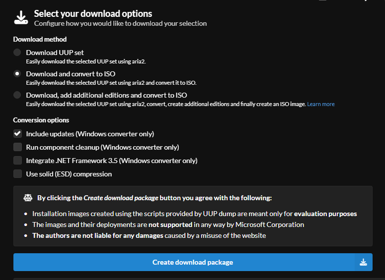
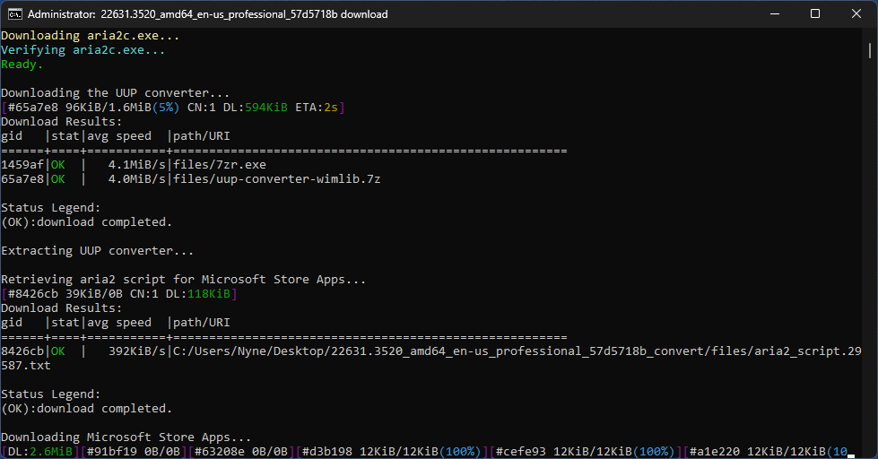
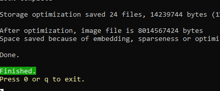
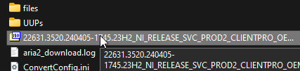

<!DOCTYPE html>
<body>

# 🚀 NeptuneOS Installation

> We are not responsible for any personal files you may lose, or any hardware issues you may experience while using NeptuneOS.  
> We are fully open source, and NOT for sale.

> If something has a ⭐, this means it is the recommended method.

## 🔍 Prerequisites

- A USB (Optional)
- A backup of your personal files on another drive
- A general understanding of your system, and windows itself

## 💻 Reinstalling Windows

You must reinstall windows to install NeptuneOS. This is to prevent unforseen issues in the OS.  
If you install NeptuneOS over an existing Windows install, especially one that's already optimized. You will experience issues.  
Your Windows ISO edition **must** be Pro or Enterprise.

Why Pro? 💬

 
Home editions do not support a numerous amount of registry tweaks that are supported in Pro, such as those related to the Group Policy.

## 💽 Downloading your ISO

There are a few methods of obtaining a Windows ISO.  

<strong>

UUP ⭐</strong>

 

<h2> UUPDump Guide</h2>
    <ul>
<li> Using UUPDump, you get a up to date stock Pro ISO of whatever windows version you desire </li>
<li> This means you will not have to update Windows upon installing. </li>
<li> Easily supports both USB and Non-USB installation methods 
<li> However, the ISO has to be built using their provided scripts, which takes some time depending on your systems processor. </li>
    </ul>
 
<h2> Getting your ISO from UUPDump</h2>
<li>Head over to <a href="https://uupdump.net/known.php">UUPDump</a></li>
<li>At the top of the window, choose the latest build of your desired Windows version as shown in the screenshot. Make sure that your system and NeptuneOS support it.</li>
 

 
<li> Once you selected your ISO, you will be presented with a list of builds for that version.
<li> Make sure you select one titled "Windows 1x, version xxxx" as shown in the screenshot. (<i>X = Version Number</i>)</li>
<li> Also make sure you select <b>amd64</b>, do NOT select arm64
 

<li> The next screen will prompt you for your language. Please select yours, and click Next.
 
<blockquote> Please note that the NeptuneOS installer will be in English. Language translation <i>may</i> be added in the future.</blockquote>
<li> You will be prompted to Choose your Edition. Make sure <b>Windows Pro</b> is the only thing checked.</li>
<li> The final screen will ask you for Download Options. Please copy the following screenshot. </li>
 

 
<li> You will download a zip file with a name such as <i>22631.3520_amd64_en-us_professional_57d5718b_convert.zip</i>, please extract this to your desktop to a folder <b>with no spaces</b>
<li> After extracting, please open the folder and run <i>uup_download_windows.cmd</i> to start compiling the ISO automatically. This will take some time depending on network and processor speeds.
<li> The script will start runnning and will appear as such</li>
 

 
<li> When the script finishes, you will have your Windows ISO in the folder that you extracted the script into. </li>
 
 
 
<li> Please follow the next part of the guide to Install your ISO</li>

 
<strong>

MASS</strong>

 
<h2> MASS Guide</h2>
    <ul>
<li> Using MASS, you are downloading a full Windows ISO with every edition present</li>
<li> You will have to update Windows upon installation
<li> This method also requires a few extra steps to install Windows Pro edition from the ISO
<li> The ISO is already compiled, you are only downloading it
    </ul>

<h2>Getting your ISO from MASS</h2>
<li> Download Windows 10 <a href="https://drive.massgrave.dev/en-us_windows_10_consumer_editions_version_22h2_updated_march_2024_x64_dvd_2ff6c8a4.iso">from here</a>
<li> Download Windows 11 <a href="https://drive.massgrave.dev/en-us_windows_11_consumer_editions_version_23h2_updated_march_2024_x64_dvd_bcbf6ac6.iso">from here</a>
<li> Download Windows Server 2022 (21H1) <a href="https://drive.massgrave.dev/en-us_windows_server_2022_updated_march_2024_x64_dvd_f6700d18.iso">from here</a>

## Installing your ISO

Just like obtaining an ISO, there are multiple ways to install one.  
This section will feature a guide on how to install a Windows Pro ISO with a usb, and without a USB. 
Please note that if you downloaded your ISO from MASS, you will not be able to directly install the ISO without extra steps. 

### Without USB Method

To install Windows witohut a USB, please go to <a href="https://github.com/iidanL/InstallWindowsWithoutUSB">this repository</a> and download the ZIP.

<li>Press Win+R and type <i>diskmgmt.msc</i></li>
<li>Locate your current drive, and shrink it at least 60 GB</li>
<li>Right click the unallocated partition, and create a new simple volume. Name it whatever you desire</li>
<li> Assign the drive letter, and remember it</li>
<li>Extract <i>InstallWindowsWithoutUSB-main</i> to your desktop</li>
<li>Open the extracted folder, and open <i>Install Windows.bat</i></li>
<li>You will be prompted to locate your ISO and open it</li>
<li>Once the process completes, type the letter of the drive you created a partition for. (e.g. D, or F)</li>
<li>Reboot your PC to boot to the newly installed Windows</li>

 

### With USB Method

To install windows with a USB, please make sure your USB is at least 8GB.

<strong>Ventoy ⭐</strong>

<h2>Ventoy USB Method</h2>
 
<li>Start by <a href="https://www.ventoy.net/en/download.html">Downloading Ventoy</a></a>
<li>Extract the downloaded folder, and open <i>Ventoy2Disk.exe</i></li>
<li>Select your USB in the dropdown, and click Install</li>
<li>When the process is finished, find your Ventoy drive, and simply drop the ISO in the root of the folder

<strong>Rufus</strong>

</body>
