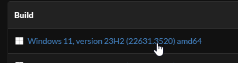

<!DOCTYPE html>
<body>

# 🚀 NeptuneOS Installation

> We are not responsible for any personal files you may lose, or any hardware issues you may experience while using NeptuneOS.  
> We are fully open source, and NOT for sale.

> If something has a ⭐, this means it is the recommended method.

## 🔍 Prerequisites

- A USB (Optional)
- A backup of your personal files on another drive
- A general understanding of your system, and windows itself

## 💻 Reinstalling Windows

You must reinstall windows to install NeptuneOS. This is to prevent unforseen issues in the OS.  
If you install NeptuneOS over an existing Windows install, especially one that's already optimized. You will experience issues.  
Your Windows ISO edition **must** be Pro or Enterprise.

Why Pro? 💬

 
Home editions do not support a numerous amount of registry tweaks that are supported in Pro, such as those related to the Group Policy.

## 💽 Downloading your ISO

There are a few methods of obtaining a Windows ISO.  

UUP ⭐

 
<h2> UUPDump Guide</h2> 
<li> Using UUPDump, you get a up to date stock Pro ISO of whatever windows version you desire </li>
<li> This means you will not have to update Windows upon installing. </li>
<li> Easily supports both USB and Non-USB installation methods 
<li> However, the ISO has to be built using their provided scripts, which takes some time depending on your systems processor. </li>
 
<h2> Getting your ISO from UUPDump</h2>
<li>Head over to <a href="https://uupdump.net/known.php">UUPDump</a></li>
<li>At the top of the window, choose the latest build of your desired Windows version as shown in the screenshot. Make sure that your system and NeptuneOS support it.</li>
 

 
<li> Once you selected your ISO, you will be presented with a list of builds for that version.
<li> Make sure you select one titled "Windows 1x, version xxxx" as shown in the screenshot. (<i>X = Version Number</i>)</li>
<li> Also make sure you select <b>amd64</b>, do NOT select arm64
 

<li> The next screen will prompt you for your language. Please select yours, and click Next.
 
<blockquote> Please note that the NeptuneOS installer will be in English. Language translation <i>may</i> be added in the future.</blockquote>
<li> You will be prompted to Choose your Edition. Make sure <b>Windows Pro</b> is the only thing checked.</li>
<li> The final screen will ask you for Download Options. Please copy the following screenshot. </li>
 

 
<li> You will download a zip file with a name such as <i>22631.3520_amd64_en-us_professional_57d5718b_convert.zip</i>, please extract this to your desktop to a folder <b>with no spaces</b>
<li> After extracting, please open the folder and run <i>uup_download_windows.cmd</i> to start compiling the ISO automatically. This will take some time depending on network and processor speeds.
<li> The script will start runnning and will appear as such</li>
 

 
<li> When the script finishes, you will have your Windows ISO in the folder that you extracted the script into. </li>
 
 
 
<li> Please follow the next part of the guide to Install your ISO</li>

 

MASS

 
<h2> MASS Guide</h2>
    <ul>
<li> Using MASS, you are downloading a full Windows ISO with every edition present</li>
<li> You will have to update Windows upon installation
<li> This method also requires a few extra steps to install Windows Pro edition from the ISO
<li> The ISO is already compiled, you are only downloading it
    </ul>

## Installing your ISO

</body>
